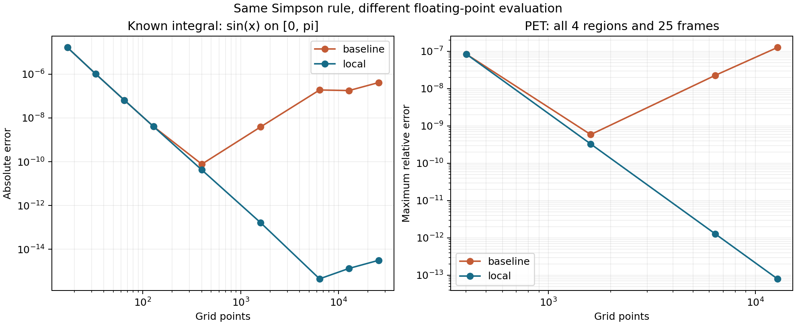

# Experimental contribution: stable evaluation of Simpson integration

> **Historical report of the initial opt-in experiment.** The user subsequently
> requested mainline adoption and full regeneration. Stable Simpson weights are
> now the default, with additional stable exponential/derivative calculations.
> See [NUMERICAL_CHANGES_README.md](NUMERICAL_CHANGES_README.md) for the current
> implementation and results. The measurements below describe the initial run;
> linked generated artifacts are regenerated by the current code.

## Recommendation and scope

**Use local-coordinate Simpson weights to reduce floating-point cancellation.**
This is a small numerical-analysis contribution to the existing implementation:
the interpolation polynomial, integration rule, PET model and fitting algorithm
stay the same. Only the arithmetic used to calculate three integration weights
changes. The experiment is implemented and selectable with `local_weights=True`;
the default remains the original implementation for reproducibility.

The reason for choosing this is concrete. The repository already identified a
round-off problem in `DECISIONS.md`, D-M5-6: its Simpson result becomes less
accurate on fine grids because it subtracts cubic antiderivatives evaluated at
nearby absolute coordinates. Local coordinates remove that particular source of
cancellation. This directly connects interpolation, numerical integration,
truncation error and floating-point error from the course.

This is an implementation contribution, **not a new integration method or an
improvement to the paper's identifiability theorem**. The previous team had
already suggested the remedy in D-M5-6; the contribution here is the implemented
option, derivation, controlled measurements and checks.

## What the screenshot does and does not tell us

The screenshot agrees with the stored `paper_settings` variant in
[`grid_paper_settings.json`](results/m4/grid_paper_settings.json):

| Noise | Paper failures / 240 | Our failures / 240 |
|---|---:|---:|
| None | 1 | 33 |
| High count | 19 | 18 |
| Normal count | 35 | 20 |
| Low count | 42 | 161 |
| Total | 97 / 960 | 232 / 960 |

Here failure uses the harness's paper-style criterion: a diverged run or final
parameter error no smaller than its initial error. It is not synonymous with
floating-point overflow.

The existing investigation (D-M5-7 and `logs/failures.md`) reports that 158 of the
161 low-count failures stop at iteration zero. No integration or step-size change
inside a later iteration can rescue a run that never reaches that iteration.
That observation motivates checking the observation-noise model and discrepancy
threshold, rather than lowering a threshold merely to obtain nicer counts.
The RMS-to-norm correction is already implemented; it would not be a new
contribution. The remaining noiseless failures warrant separate diagnosis.

**The Simpson experiment does not fix this table.** The actual call path is:

```text
IRGNM -> forward_operator -> closed_form_C_T
independent validation -> quadrature_C_T -> simpson_diag
```

Changing Simpson weights improves the second path. Claiming it reduces IRGNM
failures would be unjustified. Its benefit to the project is a more accurate,
independent numerical calculation against which the analytical PET model can be
checked. If the requirement becomes specifically “reduce Table 1 failures,” this
is not the appropriate contribution; that would require a separate experiment.

## The numerical problem

For three nodes `x0 < x1 < x2`, the original implementation integrates their
quadratic Lagrange interpolant. Each weight is evaluated as

```text
w_a = [P(x2) - P(x0)] / [(xa - xb)(xa - xc)]
P(x) = x^3/3 - (xb + xc)x^2/2 + xb*xc*x
```

This is correct in exact arithmetic. On a fine grid away from zero, the terms
inside `P` are much larger than the small basis integral we seek. Subtracting
nearby antiderivative values loses significant digits; division by a small
denominator magnifies the absolute error. Making the grid finer can therefore
make the implemented result worse, even while the theoretical discretization
error decreases.

The issue is especially easy to expose by translating the nodes: the integral
of the same sampled quadratic should not change just because its interval starts
at 1000 instead of 0. The original formula nevertheless becomes less accurate.
This is evidence of an evaluation problem, not inadequate polynomial degree.

## Derivation of the change

Set `h0 = x1-x0`, `h1 = x2-x1`, `H = h0+h1`, and use the local variable
`u = x-x0`. The three nodes are now `0, h0, H`. Their Lagrange basis functions are

```text
L0(u) = (u-h0)(u-H) / (h0*H)
L1(u) = u(H-u)       / (h0*h1)
L2(u) = u(u-h0)      / (H*h1)
```

Integrate each over `[0,H]` and simplify **before floating-point evaluation**:

```text
w0 = H/6 * (2 - h1/h0)
w1 = H/6 * (H/h0) * (H/h1)
w2 = H/6 * (2 - h0/h1)

integral approximately = w0*y0 + w1*y1 + w2*y2
```

For example, integrating `L0` gives
`[H^3/3 - (h0+H)H^2/2 + h0*H^2]/(h0*H)`;
simplifying yields `H*(2*h0-h1)/(6*h0)`, the expression for `w0` above.
There are no cubic expressions involving the absolute position `x0` in the
resulting calculation.

For equal widths `h0=h1=h`, the weights become `h/3, 4h/3, h/3`: ordinary
Simpson's rule. For unequal widths, the formula still integrates quadratic
polynomials exactly in exact arithmetic. Cubic exactness needs equal spacing;
see the [SciPy Simpson documentation](https://docs.scipy.org/doc/scipy-1.14.1/reference/generated/scipy.integrate.simpson.html)
for this distinction. The implementation is hand-written and does not call SciPy.

This reformulation does not raise Simpson's theoretical order. On uniform grids,
the usual fourth-order convergence remains; the goal is to postpone the point
where arithmetic error hides that convergence. No blanket fourth-order claim is
made for arbitrary irregular grids.

## How it improves a real project calculation

The paper's Lemma 5, equation (1), gives, with `a=k2+k3`,

```text
C_T(t) = (K1*k2/a)*exp(-a*t) * integral_0^t exp(a*s)*C_P(s) ds
       + (K1*k3/a)          * integral_0^t C_P(s) ds.
```

`quadrature_C_T` computes these two integrals numerically. If their errors are
`e1` and `e2`, their contribution to the tissue-curve error is exactly

```text
Delta C_T = (K1*k2/a)*exp(-a*t)*e1 + (K1*k3/a)*e2.
```

Reducing arithmetic error in the integrals therefore reduces a source of forward
calculation error. It is not a guarantee that every individual output improves:
truncation errors, round-off and cancellation between the two terms may interact.
That is why the experiment measures all four regions and all 25 frame times.

## Controlled experiment and measured results

Run [`experiments/local_simpson.py`](experiments/local_simpson.py). It compares
the baseline and local formulas with identical float64 data, nodes, pair order,
sequential summation and leftover-interval policy. No compensated summation,
adaptive grid, solver tuning or random sampling is introduced.

The experiment includes three known integrals (`sin`, `exp`, `1/(1+x^2)`),
translated nonuniform quadratic samples, and the actual PET model. For PET it
uses the existing graded grid `s=t*u^3`, the constants from `src/config.py`, and
every region/frame combination. Error is the maximum pointwise relative
difference from the existing closed-form solution. That solution is an
independent formula, not an infinite-precision oracle.

Results are saved in
[`comparison.json`](results/experimental_local_simpson/comparison.json), with
the configuration hash, source hashes, environment versions and `seed: null`
(the experiment is deterministic and uses no random generator).

| PET grid points | Original maximum relative error | Local-weight maximum relative error |
|---:|---:|---:|
| 401 | 8.415091e-8 | 8.415774e-8 |
| 1,601 | 5.880318e-10 | 3.293577e-10 |
| 6,401 | 2.270355e-8 | 1.285976e-12 |
| 12,801 | 1.269894e-7 | 7.988898e-14 |

At 401 points the new result is marginally worse: discretization error dominates
and the baseline's arithmetic error happens to offset a small part of it. At
the existing 1,601-point setting the improvement is about **1.79 times**. At
6,401 points it is about **17,700 times**. The strongest evidence is the refinement
trend, not a claim that every sample or every grid improves.

The known-integral check gives independent supporting evidence at 12,801 points:

| Integral | Original absolute error | Local-weight absolute error |
|---|---:|---:|
| `sin(x)` on `[0,pi]` | 1.785855e-7 | 1.332268e-15 |
| `exp(x)` on `[0,1]` | 2.184143e-6 | 2.886580e-15 |
| `1/(1+x^2)` on `[0,1]` | 4.659198e-7 | 4.440892e-15 |

For the translated quadratic, the original absolute error grows from
`8.88e-16` at offset 0 to `6.36e-7` at offset 1000 and `1.08e4` at offset
1,000,000. The local result matches the float64 exact-integral reference at all
three offsets (reported error zero, not a claim of arbitrary precision).

Validation: **151 tests passed**, including 11 new experimental tests; the
Track A guard passed all 3 checks. A process-local mutation that substitutes the
original weight formula for the new one causes 3 of 4 targeted tests to fail
(two translations and the fine-grid sine check). No on-disk source mutation was
left behind. Environment: Python 3.12.1, NumPy 2.2.6, Windows; configuration hash
`2f38ba062972`. Full run details are in
[`handoffs/RUN_EXPERIMENT_LOCAL_SIMPSON.md`](handoffs/RUN_EXPERIMENT_LOCAL_SIMPSON.md).



## Implementation and reproduction

| File | Change |
|---|---|
| `src/quadrature.py` | One local-weight helper; optional `local_weights` argument in `simpson` and `simpson_diag` |
| `src/forward_model.py` | Pass the option to both integrals in `quadrature_C_T` |
| `experiments/local_simpson.py` | Paired accuracy study, JSON and figure |
| `tests/test_local_simpson.py` | Exact-integral, translation, convergence, fine-grid and PET checks |

The original helper remains the default. Existing experiment results are not
overwritten; the new experiment writes to its own directory. The number of
operations remains linear in the number of grid points. Runtime improvement is
not a measured claim of this experiment.

From the repository root:

```powershell
python -m venv .venv
.venv/Scripts/python.exe -m pip install -r requirements.txt
.venv/Scripts/python.exe experiments/local_simpson.py
.venv/Scripts/python.exe -m pytest -q
.venv/Scripts/python.exe -m pytest tests/test_no_library_solvers.py -q
```

To use the option directly:

```python
value = simpson(x, y, local_weights=True)
values, flags = quadrature_C_T(
    t, K1, k2, k3, lam, mu, GradedGridSpec(n=6401, q=3.0),
    local_weights=True,
)
```

## Limitations and a presentation-ready claim

Very uneven adjacent widths can still produce large or negative weights and
amplify noisy samples. Subtracting node coordinates cannot recover spacing already
lost when those coordinates were stored in float64. Sequential summation still
rounds. An odd number of intervals still uses the original final trapezoid, which
can dominate the integration error. This experiment does not address overflow in
exponential evaluation or nonlinear iteration failures.

A defensible presentation statement is:

> We derived and implemented an algebraically equivalent local-coordinate
> evaluation of nonuniform Simpson weights. This removes a demonstrated source
> of subtractive cancellation. On the project's PET forward-model check at
> 6,401 grid points, maximum relative error fell from 2.27e-8 to 1.29e-12, while
> preserving the model and integration rule. The improvement is in numerical
> integration and validation accuracy; it does not change IRGNM failure counts.

The next sensible decision is whether to adopt this option as the default in a
separate change and regenerate affected M1/M2 reports. Matching the paper's
failure table remains a separate investigation.
